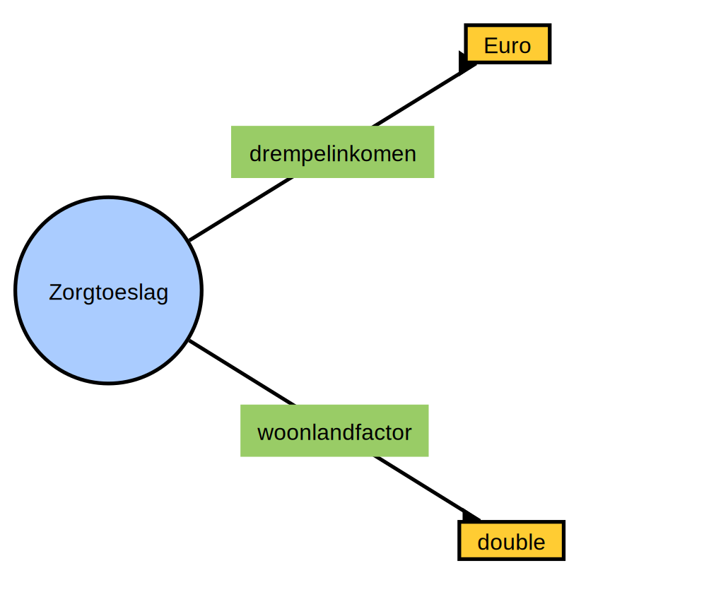

# owl

## Status

This is not a complete OWL Ontology reader/writer implementation. It reads and writes the WebVOWL Json Specification. WebVOWL can be found at: http://www.visualdataweb.de/webvowl

Unit Test currently produces an owl:class with a DataProperty with a corresponding Datatype.

## Roadmap

1. Easily create WebVOWL Ontologies in code.
2. Convert [Urukagina](https://www.github.com/sjefvanleeuwen/virtual-society-urukagina) YAML files to WebVOWL Ontologies.
3. Convert OpenAPi YAML files to WebVOWL Ontologies.
